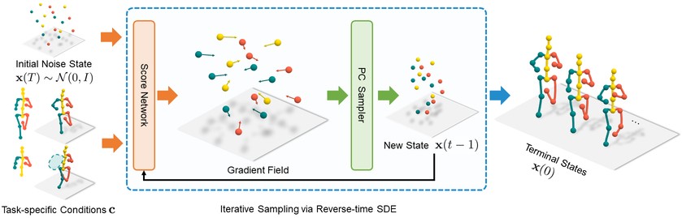
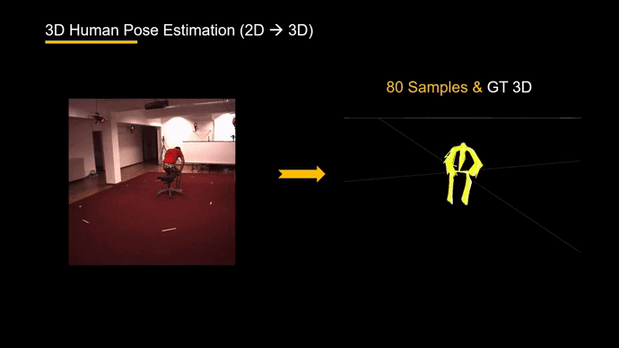
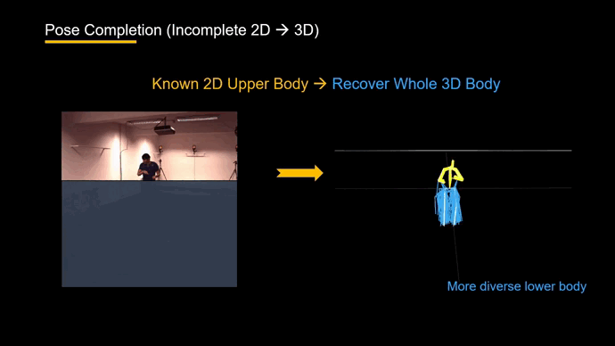
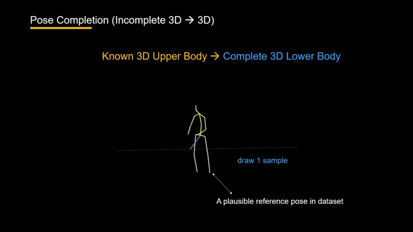
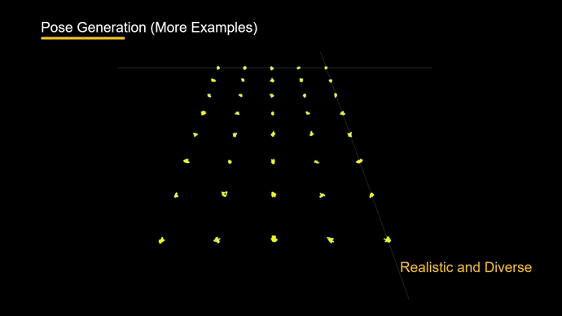
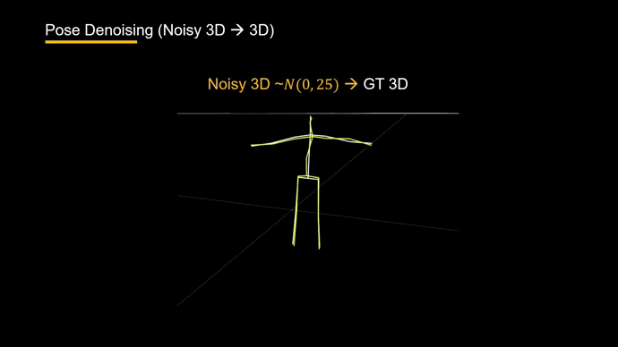
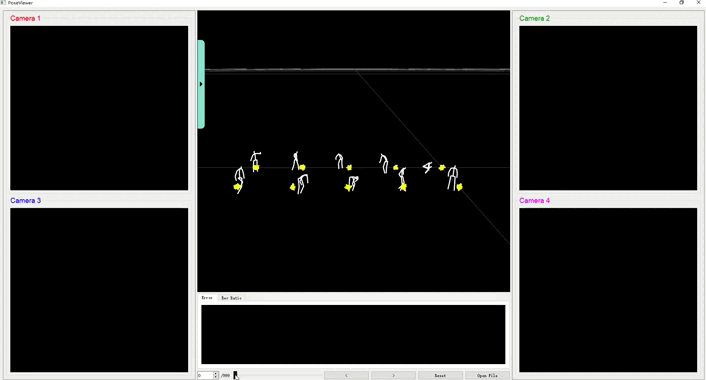

# GFPose: Learning 3D Human Pose Prior with Gradient Fields

<div align="left">

  <a></a>
  <a href="https://github.com/Embracing/3DPoseViewer/blob/main/LICENSE">![License](https://img.shields.io/github/license/metaopt/torchopt?label=license&logo=data:image/svg+xml;base64,PHN2ZyB4bWxucz0iaHR0cDovL3d3dy53My5vcmcvMjAwMC9zdmciIHZpZXdCb3g9IjAgMCAyNCAyNCIgd2lkdGg9IjI0IiBoZWlnaHQ9IjI0IiBmaWxsPSIjZmZmZmZmIj48cGF0aCBmaWxsLXJ1bGU9ImV2ZW5vZGQiIGQ9Ik0xMi43NSAyLjc1YS43NS43NSAwIDAwLTEuNSAwVjQuNUg5LjI3NmExLjc1IDEuNzUgMCAwMC0uOTg1LjMwM0w2LjU5NiA1Ljk1N0EuMjUuMjUgMCAwMTYuNDU1IDZIMi4zNTNhLjc1Ljc1IDAgMTAwIDEuNUgzLjkzTC41NjMgMTUuMThhLjc2Mi43NjIgMCAwMC4yMS44OGMuMDguMDY0LjE2MS4xMjUuMzA5LjIyMS4xODYuMTIxLjQ1Mi4yNzguNzkyLjQzMy42OC4zMTEgMS42NjIuNjIgMi44NzYuNjJhNi45MTkgNi45MTkgMCAwMDIuODc2LS42MmMuMzQtLjE1NS42MDYtLjMxMi43OTItLjQzMy4xNS0uMDk3LjIzLS4xNTguMzEtLjIyM2EuNzUuNzUgMCAwMC4yMDktLjg3OEw1LjU2OSA3LjVoLjg4NmMuMzUxIDAgLjY5NC0uMTA2Ljk4NC0uMzAzbDEuNjk2LTEuMTU0QS4yNS4yNSAwIDAxOS4yNzUgNmgxLjk3NXYxNC41SDYuNzYzYS43NS43NSAwIDAwMCAxLjVoMTAuNDc0YS43NS43NSAwIDAwMC0xLjVIMTIuNzVWNmgxLjk3NGMuMDUgMCAuMS4wMTUuMTQuMDQzbDEuNjk3IDEuMTU0Yy4yOS4xOTcuNjMzLjMwMy45ODQuMzAzaC44ODZsLTMuMzY4IDcuNjhhLjc1Ljc1IDAgMDAuMjMuODk2Yy4wMTIuMDA5IDAgMCAuMDAyIDBhMy4xNTQgMy4xNTQgMCAwMC4zMS4yMDZjLjE4NS4xMTIuNDUuMjU2Ljc5LjRhNy4zNDMgNy4zNDMgMCAwMDIuODU1LjU2OCA3LjM0MyA3LjM0MyAwIDAwMi44NTYtLjU2OWMuMzM4LS4xNDMuNjA0LS4yODcuNzktLjM5OWEzLjUgMy41IDAgMDAuMzEtLjIwNi43NS43NSAwIDAwLjIzLS44OTZMMjAuMDcgNy41aDEuNTc4YS43NS43NSAwIDAwMC0xLjVoLTQuMTAyYS4yNS4yNSAwIDAxLS4xNC0uMDQzbC0xLjY5Ny0xLjE1NGExLjc1IDEuNzUgMCAwMC0uOTg0LS4zMDNIMTIuNzVWMi43NXpNMi4xOTMgMTUuMTk4YTUuNDE4IDUuNDE4IDAgMDAyLjU1Ny42MzUgNS40MTggNS40MTggMCAwMDIuNTU3LS42MzVMNC43NSA5LjM2OGwtMi41NTcgNS44M3ptMTQuNTEtLjAyNGMuMDgyLjA0LjE3NC4wODMuMjc1LjEyNi41My4yMjMgMS4zMDUuNDUgMi4yNzIuNDVhNS44NDYgNS44NDYgMCAwMDIuNTQ3LS41NzZMMTkuMjUgOS4zNjdsLTIuNTQ3IDUuODA3eiI+PC9wYXRoPjwvc3ZnPgo=)</a>
  [](https://arxiv.org/abs/2212.08641)

</div>

This repo contains the official implementation for the CVPR2023 paper: [GFPose: Learning 3D Human Pose Prior with Gradient Fields](https://arxiv.org/abs/2212.08641). **With GFPose, you can learn 3D pose prior and perform 5 downstream tasks in one model.**

by [Hai Ci](https://haici.cc), [Mingdong Wu](https://aaronanima.github.io/), [Wentao Zhu](https://wentao.live/), [Xiaoxuan Ma](https://shirleymaxx.github.io/), [Hao Dong](https://zsdonghao.github.io/), [Fangwei Zhong](https://fangweizhong.xyz/) and [Yizhou Wang](https://cfcs.pku.edu.cn/english/people/faculty/yizhouwang/index.htm).

<p align="left">
  <a href="https://sites.google.com/view/gfpose/home">Project Site (Demo)</a> |
  <a href="https://arxiv.org/abs/2212.08641">Arxiv</a>
</p>

<!-- <p align="center">
  
</p> -->


## Main requirements

* python >= 3.9
* numpy
* scipy
* pytorch
* pprint
* absl-py
* ml-collections
* prettytable
* tensorboardX
* [3DPoseViewer (for visualization)](https://github.com/Embracing/3DPoseViewer)

## File structure

Download 3d keypoints [here](https://drive.google.com/drive/folders/1l-Xn5wiDd5ZcnClcqgiBCjHPp4ZjVVsY?usp=sharing). For corresponding h36m images (optional), please register on the [official website](http://vision.imar.ro/human3.6m/related_datasets.php). Download the pretrained U3D model [here](https://drive.google.com/drive/folders/1GhBhDPeadejbTHSzjmwjrFBDx0aH2B9f?usp=share_link). Organize data and checkpoints in the following structure.

```
${POSE_ROOT}
|-- configs
|-- lib
|-- run
|-- checkpoint
    |-- u3d
        |-- best_model.pth
|-- data
    |-- h36m
        |-- h36m_train.pkl
        |-- h36m_test.pkl
        |-- h36m_sh_dt_ft.pkl
```

## Train the unified model (U3D) form scratch

```bash
CUDA_VISIBLE_DEVICES=0 python -m run.train_fc_adv_3d --config configs/subvp/h36m_ncsnpp_deep_continuous.py --name u3d
```

## Evaluate on five different tasks

### Task1 - 3D Pose Estimation

Sample 200 hypotheses with SDE.

```bash
CUDA_VISIBLE_DEVICES=0,1,2,3 python -m run.eval_fc_mp_adv_3d --config configs/subvp/h36m_ncsnpp_deep_continuous.py --ckpt-dir checkpoint/u3d --best --sample 640 --gpus 4 --hypo 200 --save results est
```

Sample 1 hypothesis with probability flow ODE.

```bash
CUDA_VISIBLE_DEVICES=0 python -m run.eval_fc_mp_adv_3d --config configs/subvp/h36m_ncsnpp_deep_continuous.py --ckpt-dir checkpoint/u3d --best --sample 640 --gpus 1 --hypo 1 --pflow --save trajs est
```

Visualize

```bash
python -m run.visualize --num-human 1 --num-hypo 80 --vis-gt
```

<p align="center">
  
</p>


### Task2 - 2D Pose Completion from occlusion

Evaluate with 200 hypotheses and 2 randomly selected missing joints.

```bash
CUDA_VISIBLE_DEVICES=0,1,2,3 python -m run.eval_fc_mp_adv_3d --config configs/subvp/h36m_ncsnpp_deep_continuous.py --ckpt-dir checkpoint/u3d --best --sample 640 --gpus 4 --hypo 200 --save results comp2d --randj 2
```

Manually specified missing joints (e.g. right leg).

```bash
CUDA_VISIBLE_DEVICES=0,1,2,3 python -m run.eval_fc_mp_adv_3d --config configs/subvp/h36m_ncsnpp_deep_continuous.py --ckpt-dir checkpoint/u3d --best --sample 640 --gpus 4 --hypo 200 --save results comp2d --jlist 1,2,3
```

Visualize

```bash
python -m run.visualize --num-human 1 --num-hypo 40 --vis-gt
```

<p align="center">
  
</p>

### Task3 - 3D Pose Completion from missing joints

Evaluate with 1 hypothesis and 3 randomly selected missing joints.

```bash
CUDA_VISIBLE_DEVICES=0 python -m run.eval_fc_mp_adv_3d --config configs/subvp/h36m_ncsnpp_deep_continuous.py --ckpt-dir checkpoint/u3d --best --sample 640 --gpus 1 --hypo 1 --pflow --save trajs comp3d --randj 3
```

Manually specified missing joints (e.g. two legs).

```bash
CUDA_VISIBLE_DEVICES=0 python -m run.eval_fc_mp_adv_3d --config configs/subvp/h36m_ncsnpp_deep_continuous.py --ckpt-dir checkpoint/u3d --best --sample 640 --gpus 1 --hypo 1 --pflow --save trajs comp3d --jlist 1,2,3,4,5,6
```

Visualize

```bash
python -m run.visualize --num-human 1 --num-hypo 1 --vis-gt
```

<p align="center">
  
</p>

### Task4 - 3D Pose Generation

```bash
CUDA_VISIBLE_DEVICES=0 python -m run.eval_fc_mp_adv_3d --config configs/subvp/h36m_ncsnpp_deep_continuous.py --ckpt-dir checkpoint/u3d --best --sample 640 --gpus 1 --hypo 1 --save trajs gen
```

Visualize

```bash
python -m run.visualize --num-human 40 --num-hypo 1 --num-perline 5
```

<p align="center">
  
</p>

### Task5 - 3D Pose Denoising

Denoise mocap data.

```bash
CUDA_VISIBLE_DEVICES=0 python -m run.denoise_fc_adv_3d --config configs/subvp/h36m_ncsnpp_deep_continuous.py --ckpt-dir checkpoint/u3d --best --save den --noise-type gaussian --std 5 --t 0.05
```

Visualize

```bash
python -m run.visualize --num-human 1 --num-hypo 1 --vis-gt
```

<p align="center">
  
</p>

## GUI

This repo includes a modified version of [3DPoseViewer](https://github.com/Embracing/3DPoseViewer) to visualize the multi-hypotheses and diffusion process. Please find the dependencies to run this viewer [here](https://github.com/Embracing/3DPoseViewer#install).

```shell
python -m run.visualize
Args
  --num-human  # number of persons visualized in a batch
  --num-hypo  # number of sampled hypotheses to visualize
  --vis-gt  # whether to visualize humans
  --num-perline  # number of humans to plot in a line
```

<p align="center">
  
</p>

## Citation

If you find this code useful in your project, please consider citing:

```bibtex
@article{ci2022gfpose,
  title={GFPose: Learning 3D Human Pose Prior with Gradient Fields},
  author={Ci, Hai and Wu, Mingdong and Zhu, Wentao and Ma, Xiaoxuan and Dong, Hao and Zhong, Fangwei and Wang, Yizhou},
  journal={arXiv preprint arXiv:2212.08641},
  year={2022}
}
```

## Acknowledgement

This repo is built on the excellent work [score_sde](https://github.com/yang-song/score_sde_pytorch) by Yang Song.
